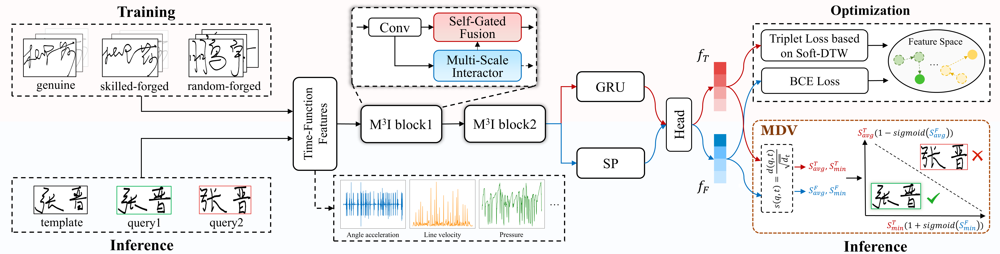

# <div align="center">🌈SPECTRUM

<div align="center">
  <a href="http://dlvc-lab.net/lianwen/"> </a>
  <a href="https://dl.acm.org/doi/10.1145/3746027.3755200"> </a>
  <a href="https://arxiv.org/abs/2508.01427"> </a>
  <a href="https://huggingface.co/papers/2508.01427"> </a>
  <a href="./LICENSE"> </a>
<p></p>


<a href="https://arxiv.org/abs/2508.01427"> <b>Capturing More: Learning Multi-Domain Representations for Robust Online Handwriting Verification</b> </a>

<b>ACM International Conference on Multimedia (ACM MM), 2025, Oral</b>

:star:Official code of the SPECTRUM model.
</div>

## <div align="center">:ocean:Introduction</div>

SPECTRUM is an online handwriting verification model, designed to integrate temporal and frequency features from a micro-to-macro level to enrich personal handwriting representations.



## <div align="center">:earth_asia:Environment</div>

```
git clone https://github.com/NiceRingNode/SPECTRUM.git
cd SPECTRUM
conda create -n spectrum python=3.8.16
conda activate spectrum
pip install -r requirements.txt
```

## <div align="center">:hammer_and_pick:Data Preparation</div>

Download the [MSDS-ChS](https://github.com/HCIILAB/MSDS), [MSDS-TDS](https://github.com/HCIILAB/MSDS), and [DeepSignDB](https://github.com/BiDAlab/DeepSignDB) datasets, and prepare the *.pkl* files for training and testing.

The preprocessed data should be placed at the `data` folder.

## <div align="center">:rocket:Train</div>

Run the following code to conduct training on the MSDS-ChS dataset:

```
python train.py --data_name signature --name msdschs --gpu 0
```

Run the following code to conduct training on the MSDS-TDS dataset:

```
python train.py --data_name real --name msdstds --gpu 0
```

Run the following code to conduct training on the DeepSignDB dataset:

```
python train.py --data_name deepsigndb --name deepsign --gpu 0
```

One can specify the running devices using the `--gpu` parameter.

## <div align="center">:shallow_pan_of_food:Test</div>

The checkpoints should be saved in the `weights` folder.

For testing on the MSDS-ChS and MSDS-TDS datasets, using the following command and replace `folder` to the folder name of the tested checkpoint (e.g., `weights/20251212-171546-msdschs`).

```
python test.py --weights weights/{folder} --epoch 39
```

For testing on the DeepSignDB dataset, first change to the `deepsign` directory.

```
cd deepsign
```

Then, specify the checkpoint's folder (e.g., `20251212-181546-deepsign`, no need to type the `weights`) using the `--weights` parameter in the `eval.sh` file and run this file for evaluation.

```
bash eval.sh
```

The results reported in the paper correspond to those after "Overall EER under global threshold".

## <div align="center">:bookmark_tabs:Citation</div>

```bibtex
@inproceedings{spectrum2025zhang,
    author = {Zhang, Peirong and Ding, Kai and Jin, Lianwen},
    title = {{Capturing More: Learning Multi-Domain Representations for Robust Online Handwriting Verification}},
    year = {2025},
    booktitle = {Proceedings of the 33rd ACM International Conference on Multimedia (ACM MM)},
    pages = {1471–1479},
    numpages = {9},
}
```

## <div align="center">:phone:Cotact</div>

Peirong Zhang: eeprzhang@mail.scut.edu.cn

## <div align="center">:palm_tree:Copyright</div>

Copyright 2025, Deep Learning and Vision Computing (DLVC) Lab, South China China University of Technology. [http://www.dlvc-lab.net](http://www.dlvc-lab.net/).
